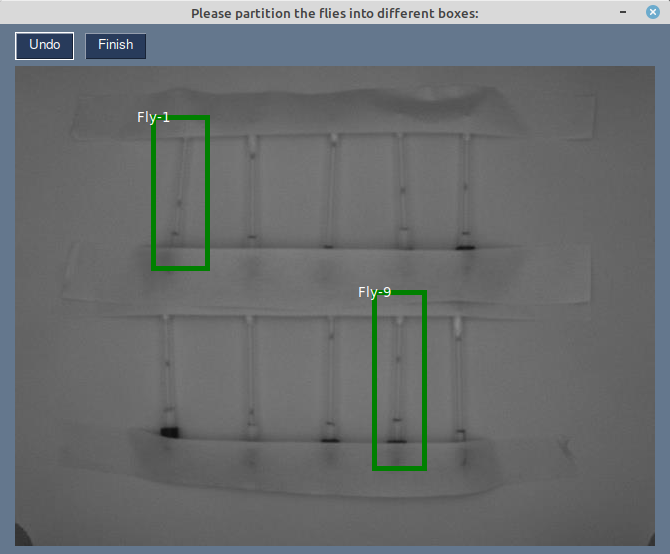

# OpenCV-DAM-System
NOTE: PROJECT IS ABANDONED FOR NOW AS LAB NO LONGER REQUIRES PROGRAM
README IS WIP, WILL REVISE LATER

## Introduction

This project emulates a Drosophila Activity Monitoring (DAM) system using OpenCV and a low spec 1 FPS camera. It was commissioned by a sleep study lab in University of Tsukuba, Japan. Its is able to analyze both a camera stream and a video file passed to it as arguments.

**Read about what a DAM system is here**: https://blogs.brandeis.edu/flyonthewall/fly-life-watching-fruit-flies-sleep/
**Video used to test program**: https://drive.google.com/file/d/1qktrlR4CitGu-efn7M3S3IUm1zbLW9oH/view?usp=sharing

## How to use:

### 1. Call using command line arguments:
	* `Flycircadian.py ( PATHTOFILE | cameraID ) ( int FramesToRun) ( CSVFilename )`
	* EXAMPLE FOR VIDEO STREAM: `Flycircadian.py Tests/flyvideo1.avi 3600 flys.csv`
	* EXAMPLE FOR CAMERA STREAM: `Flycircadian.py 0 endless flys.csv`
	 
* **PATHTOFILE**: should be the path to file or just the filename if in same directory
* **cameraID**: should be an integer ID of the camera connected to the laptop if reading from camera
* **FramesToRun**: Frames to run program, should be "endless" if running indefinitely
* **CSVFilename**: Name of csv filename to save to, program will append '.csv' to end automatically
	 
***WARNING: Program will overwrite csv files with filename in directory without warning, please move csv files
	        out of directory after each experiment***
	        
### 2. Partition flies in initial frame by dragging boxes with mouse and labeling in popup UI

* Strange results may occur if any of the boxes overlap
* Please do not click cancel on popup window for now
    
### 3. Let camera run with program for the duration of the experiment, avoid disturbing lighting condition
* Frames to set flies to asleep can be changed by changing value of TIMEOUT inside Flycircardian.py
    
### 4. Program will output results into .csv format
* Program will only save to a csv file every 5 new entrys to the log by default
